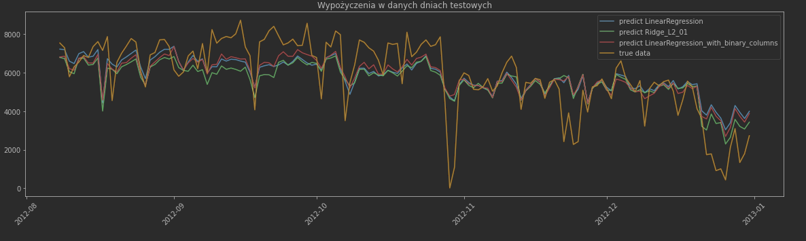
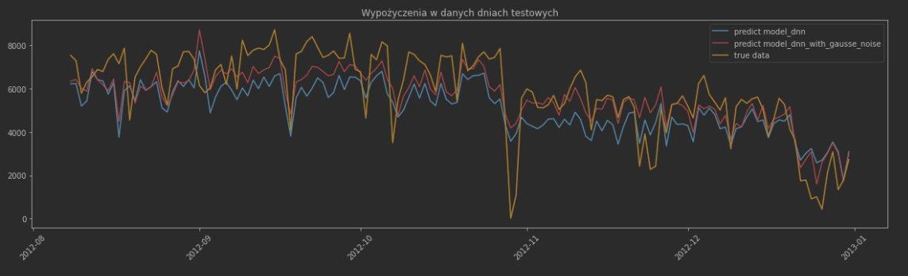

#Data Mining Methods 
It is the 5th semester of Applied Computer Science at the Warsaw University of Technology.

# Project 
It was a group project with Karol Kociołek.

Data are from kaggle challenge https://www.kaggle.com/c/bike-sharing-demand.

First part is Exploratory analysis (Analiza_Ekspolaracyjna). The purpose of the data exploratory analysis is to check the relationship between the possessed data, to examine their ranges and degree of variability, to analyze the degree of data filling, visualization.

The second part of the project (Regression_models) is related to the development of a regression model through the use of feature selection and regularization methods. 

I also compared the results from linear regression with models using deep learning.

